```mermaid
flowchart TD

    %% Fila 1: Clases Simples (no envuelven)
    FileReader["FileReader (filename/File)"]
    StringReader["StringReader (String)"]
    CharArrayReader["CharArrayReader (char[])"]

    %% Fila 2: Reader (abstract)
    Reader["Reader (abstract)"]

    %% Fila 3: Clases Compuestas (envuelven otros streams)
    BufferedReader["BufferedReader (Reader)"]
    InputStreamReader["InputStreamReader (InputStream)"]
    LineNumberReader["LineNumberReader (Reader)"]
    FilterReader["FilterReader (Reader)"]
    PushbackReader["PushbackReader (Reader)"]

    %% Herencia (todas extienden Reader)
    FileReader -- extiende --> Reader
    StringReader -- extiende --> Reader
    CharArrayReader -- extiende --> Reader
    BufferedReader -- extiende --> Reader
    InputStreamReader -- extiende --> Reader
    LineNumberReader -- extiende --> Reader
    FilterReader -- extiende --> Reader
    PushbackReader -- extiende --> Reader

    %% Agrupar visualmente filas (opcional)
    subgraph fila1[ ]
        direction LR
        FileReader
        StringReader
        CharArrayReader
    end

    subgraph fila3[ ]
        direction LR
        BufferedReader
        InputStreamReader
        LineNumberReader
        FilterReader
        PushbackReader
    end

    classDef readerClass fill:#eee,stroke-dasharray: 5 5
    class Reader readerClass

```

## **1. Clase abstracta `Reader`**  

### **Métodos principales**  
- **`read()`**: Lee un único carácter (`int`). Retorna `-1` si es fin de archivo (EOF).  
  ```java
  int c = reader.read(); // 'A' → 65, EOF → -1
  ```
- **`read(char[] cbuf)`**: Lee caracteres y los guarda en un array. Retorna número de caracteres leídos.  
  ```java
  char[] buffer = new char[100];
  int charsRead = reader.read(buffer);
  ```
- **`skip(long n)`**: Salta `n` caracteres.  
  ```java
  reader.skip(10); // Ignora los próximos 10 caracteres
  ```
- **`close()`**: Cierra el flujo (¡mejor con `try-with-resources`!).

---

## **2. `FileReader`**  

### **Métodos útiles**  
Hereda todos de `Reader`. No añade métodos nuevos, pero es la clase básica para leer archivos de texto.  

**Ejemplo**:  
```java
try (FileReader fr = new FileReader("archivo.txt")) {
    int data;
    while ((data = fr.read()) != -1) {
        System.out.print((char) data);
    }
}
```

---

## **3. `BufferedReader`**  

### **Métodos clave**  
- **`readLine()`**: Lee una línea completa (retorna `String` o `null` si es EOF).  
  ```java
  String line;
  while ((line = br.readLine()) != null) {
      System.out.println(line);
  }
  ```
- **`lines()`** (Java 8+): Retorna un `Stream<String>` con todas las líneas.  
  ```java
  br.lines().forEach(System.out::println);
  ```

---

## **4. `InputStreamReader`**  

### **Métodos útiles**  
- **`getEncoding()`**: Retorna el charset usado.  
  ```java
  System.out.println(isr.getEncoding()); // "UTF8"
  ```

---

## **5. `StringReader`**  
### **Constructores**  
```java
StringReader(String s)  // Lee de una cadena en memoria
```

### **Métodos principales**  
Los mismos que `Reader`, pero opera sobre un `String`.  

**Ejemplo**:  
```java
try (StringReader sr = new StringReader("Hola")) {
    int c;
    while ((c = sr.read()) != -1) {
        System.out.print((char) c); // Imprime "Hola"
    }
}
```

---

## **Composiciones comunes**  

### **1. Lectura eficiente de archivos** (`FileReader` + `BufferedReader`)  
```java
try (BufferedReader br = new BufferedReader(new FileReader("archivo.txt"))) {
    String line;
    while ((line = br.readLine()) != null) {
        System.out.println(line);
    }
}
```

### **2. Lectura con charset específico** (`FileInputStream` + `InputStreamReader` + `BufferedReader`)  
```java
try (BufferedReader br = new BufferedReader(
        new InputStreamReader(
            new FileInputStream("archivo.txt"), "ISO-8859-1"))) {
    // Leer líneas con encoding "ISO-8859-1"
}
```

### **3. Lectura desde un `String` en memoria** (`StringReader` + `BufferedReader`)  
```java
String data = "Línea 1\nLínea 2";
try (BufferedReader br = new BufferedReader(new StringReader(data))) {
    br.lines().forEach(System.out::println);
}
```


