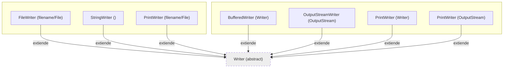

### **1. Clase abstracta `Writer`**  
Métodos base (compartidos por todas las subclases):  
- **`write(int c)`**: Escribe un único carácter.  
  ```java
  writer.write('A');
  ```
- **`write(char[] cbuf)`**: Escribe un arreglo de caracteres.  
  ```java
  char[] data = {'H', 'o', 'l', 'a'};
  writer.write(data);
  ```
- **`write(String str)`**: Escribe una cadena completa.  
  ```java
  writer.write("Hola Mundo");
  ```
- **`flush()`**: Fuerza la escritura de los datos en el destino.  
  ```java
  writer.flush();
  ```
- **`close()`**: Cierra el flujo (¡mejor usar un `try-with-resources`!).  
  ```java
  writer.close();
  ```

---

### **2. `FileWriter`**  
Además de los métodos de `Writer`:  
- **Constructores**: Permiten especificar archivos y modo *append*.  
  ```java
  FileWriter fw = new FileWriter("archivo.txt", true); // Append mode
  ```

---

### **3. `BufferedWriter`**  
Métodos clave para escritura eficiente:  
- **`newLine()`**: Escribe un salto de línea (`\n` o el del sistema).  
  ```java
  bw.write("Línea 1");
  bw.newLine(); // Equivalente a bw.write("\n");
  ```
- **`write(String str)`**: Optimizado para buffers.  
  ```java
  bw.write("Texto rápido gracias al buffer");
  ```

---

### **4. `StringWriter`**  
Útil para escribir en memoria y obtener un `String`:  
- **`toString()`**: Convierte lo escrito en un `String`.  
  ```java
  StringWriter sw = new StringWriter();
  sw.write("Guardado en memoria");
  String resultado = sw.toString(); // "Guardado en memoria"
  ```

---

### **5. `OutputStreamWriter`**  
Convierte bytes a caracteres (usa un `Charset`):  
- **`getEncoding()`**: Obtiene el encoding usado.  
  ```java
  OutputStreamWriter osw = new OutputStreamWriter(new FileOutputStream("salida.txt"), "UTF-8");
  System.out.println(osw.getEncoding()); // "UTF-8"
  ```

---

### **6. `PrintWriter`**  
Métodos avanzados para tipos de datos y formato:  
- **`print()` / `println()`**: Soporta todos los tipos básicos (`int`, `boolean`, `double`, etc.).  
  ```java
  PrintWriter pw = new PrintWriter("datos.txt");
  pw.println(42); // Escribe el número
  pw.println(true); // Escribe "true"
  pw.printf("Hoy es %s", LocalDate.now()); // Formato estilo printf
  ```
- **`printf()`**: Formatea texto (como `String.format`).  
  ```java
  pw.printf("Nombre: %s, Edad: %d", "Ana", 30);
  ```

---

### **Ejemplo de composición común** (máxima eficiencia):  
```java
try (FileWriter fw = new FileWriter("log.txt");
     BufferedWriter bw = new BufferedWriter(fw);
     PrintWriter pw = new PrintWriter(bw)) {
    
    pw.println("Fecha: " + LocalDateTime.now());
    pw.printf("Usuario: %s | Acciones: %d", "admin", 42);

} 
```
```java
try (PrintWriter pw = new PrintWriter(
        new BufferedWriter(
            new FileWriter("datos.txt", true)))) {  // Append
    
    pw.println("Línea añadida sin borrar el contenido previo");
    pw.printf("Fecha: %s%n", LocalDate.now());

}
```